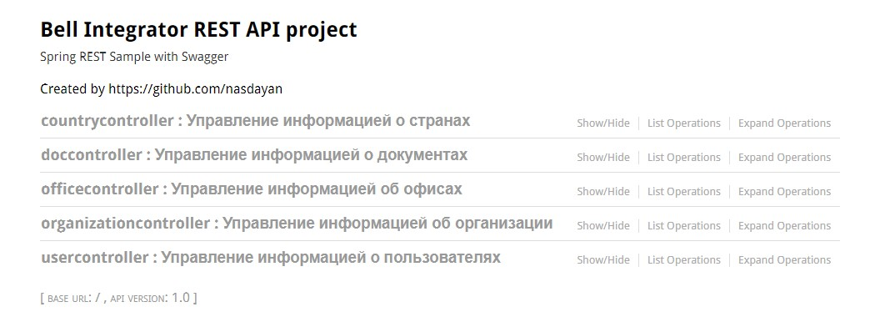

# Bell Integrator REST API Project
____

## Описание
Данное REST API предоставляет возможность:
- Управление информацией о странах
    - Получение списка всех стран
- Управление информацией о документах
    - Получение списка всех типов документов
- Управление информацией об организациях
    - Получение списка организаций по фильтру
    - Получение организации по ID
    - Обновление организации
    - Добавление организации
- Управление информацией об офисах
    - Получение списка офисов по фильтру
    - Получение офиса по ID
    - Обновление офиса
    - Добавление офиса
- Управление информацией о пользователях
    - Получение списка пользователей по фильтру
    - Получение пользователя по ID
    - Редактирование пользователя
    - Добавление пользователя

## Установка
1. Склонируйте репозиторий
2. Подтяните все зависимости из pom.xml
3. Запустите программу через Application.java
4. Перейдите на главное окно REST API по ссылке: http://localhost:8888//swagger-ui.html

Главное окно REST API:



## Функционал
API, в случае успешного запроса, возвращает ответ следующего вида (помечена как OUT):

```json5
{
    "data": {
        //то, что в параметре OUT
    }
}
```

Также, для успешного выполнения некоторых запросов серверу, требуется передать входную информацию (помечена как IN).

В случае возникновения ошибки такого:
```json5
{
    "error":"текст ошибки"
}
```

___
### Управление информацией о странах
#### Получение списка всех стран

Для получения списка всех стран сделайте POST запрос по адресу: 
http://localhost:8888//api/countries

**OUT:**
```json5
[
  {
    "name":"Российская Федерация",
    "code":"643"
  },
  ...
]
```

___
### Управление информацией о документах
#### Получение списка всех типов документов

Для получения списка всех типов документов сделайте POST запрос по адресу: 
http://localhost:8888//api/docs

```json5
[
  {
    "name":"Паспорт гражданина РФ",
    "code":"21"
  },
  ...
]
```

___
### Управление информацией об организациях
#### Получение списка организаций по фильтру

Для получения списка организаций по фильтру сделайте POST запрос по адресу: 
http://localhost:8888//api/organization/list

**IN(фильтр):**
```json5
{
  "name":"", //обязательный параметр
  "inn":"",
  "isActive":""
}
```

**OUT:**
```json5
[
  {
    "id":"",
    "name":"",
    "isActive":"true"
  },
  ...
]
```

#### Получение организации по ID

Для получения организации по id сделайте GET запрос по адресу: 
http://localhost:8888//api/organization/{id}

**OUT:**
```json5
{
  "id":"",
  "name":"",
  "fullName":"",
  "inn":"",
  "kpp":"",
  "address":"",
  "phone":"",
  "isActive":"true"
}
```

#### Обновление организации

Для обновления организации сделайте POST запрос по адресу: 
http://localhost:8888//api/organization/update

**IN:**
```json5
{
  "id":"", //обязательный параметр
  "name":"", //обязательный параметр
  "fullName":"", //обязательный параметр
  "inn":"", //обязательный параметр
  "kpp":"",  //обязательный параметр
  "address":"", //обязательный параметр
  "phone":"",
  "isActive":"true"
}
```

**OUT:**
```json5
{
    "result":"success"
}
```

#### Добавление организации

Для добавления организации сделайте POST запрос по адресу: 
http://localhost:8888//api/organization/save

**IN:**
```json5
{
  "name":"", //обязательный параметр
  "fullName":"", //обязательный параметр
  "inn":"", //обязательный параметр
  "kpp":"", //обязательный параметр
  "address":"", //обязательный параметр
  "phone":"",
  "isActive":"true"
}
```

**OUT:**
```json5
{
    "result":"success"
}
```

___
### Управление информацией об офисах
#### Получение списка офисов по фильтру

Для получения списка офисов по фильтру сделайте POST запрос по адресу: 
http://localhost:8888//api/office/list

**IN(фильтр):**
```json5
{
  "orgId":"", //обязательный параметр
  "name":"",
  "phone":"",
  "isActive": ""
}
```

**OUT:**
```json5
[
  {
    "id":"",
    "name":"",
    "isActive":"true"
  },
  ...
]
```

#### Получение офиса по ID

Для получения офиса по id сделайте GET запрос по адресу: 
http://localhost:8888//api/office/list/{id}

**OUT:**
```json5
{
  "id":"",
  "name":"",
  "address":"",
  "phone":"",
  "isActive":"true"
}
```

#### Обновление офиса

Для редактирования офиса сделайте POST запрос по адресу: 
http://localhost:8888//api/office/update

**IN:**
```json5
{
  "id":"", //обязательный параметр
  "name":"", //обязательный параметр
  "address":"", //обязательный параметр
  "phone":"",
  "isActive":"true"
}
```

**OUT:**
```json5
{
    "result":"success"
}
```

#### Добавление офиса

Для добавления офиса сделайте POST запрос по адресу: 
http://localhost:8888//api/office/save

**IN:**
```json5
{
  "orgId":"", //обязательный параметр
  "name":"",
  "address":"",
  "phone":"",
  "isActive":"true"
}
```

**OUT:**
```json5
{
    "result":"success"
}
```

___
### Управление информацией о пользователях
#### Получение списка пользователей по фильтру

Для получения списка пользователей по фильтру сделайте POST запрос по адресу: 
http://localhost:8888//api/user/list

**IN(фильтр):**
```json5
{
  "officeId":"", //обязательный параметр
  "firstName":"",
  "lastName":"",
  "middleName":"",
  "position":"",
  "docCode":"",
  "citizenshipCode":""
}
```

**OUT:**
```json5
{
  "id":"",
  "firstName":"",
  "secondName":"",
  "middleName":"",
  "position":""
}
```

#### Получение пользователя по ID

Для получения пользователя по id сделайте GET запрос по адресу: 
http://localhost:8888//api/user/{id}

**OUT:**
```json5
{
  "id":"",
  "firstName":"",
  "secondName":"",
  "middleName":"",
  "position":"",
  "phone":"",
  "docName":"",
  "docNumber":"",
  "docDate":"",
  "citizenshipName":"",
  "citizenshipCode":"",
  "isIdentified":"true"
}
```

#### Редактирование пользователя

Для редактирования пользователя сделайте POST запрос по адресу: 
http://localhost:8888//api/user/update

**IN:**
```json5
{
  "id":"", //обязательный параметр
  "officeId":"",
  "firstName":"", //обязательный параметр
  "secondName":"",
  "middleName":"",
  "position":"", //обязательный параметр
  "phone":"",
  "docName":"",
  "docNumber":"",
  "docDate":"",
  "citizenshipCode":"",
  "isIdentified":"true"
}
```

**OUT:**
```json5
{
    "result":"success"
}
```

#### Добавление пользователя

Для добавления пользователя сделайте POST запрос по адресу: 
http://localhost:8888//api/user/save

**IN:**
```json5
{
  "officeId":"", //обязательный параметр
  "firstName":"", //обязательный параметр
  "secondName":"",
  "middleName":"",
  "position":"", //обязательный параметр
  "phone":"",
  "docCode":"",
  "docName":"",
  "docNumber":"",
  "docDate":"",
  "citizenshipCode":"",
  "isIdentified":"true"
}
```

**OUT:**
```json5
{
    "result":"success"
}
```